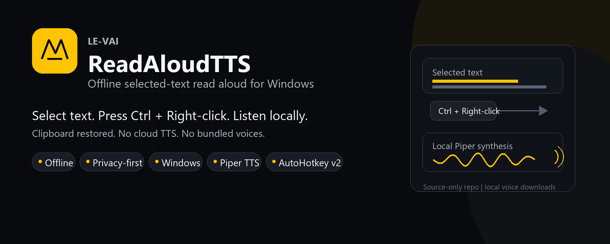

# ReadAloudTTS for Windows



Offline Windows selected-text read-aloud helper using AutoHotkey and Piper TTS. Built for local utility: select text, press `Ctrl + Right-click`, and hear it spoken without sending the text to a cloud service.

ReadAloudTTS is source-only, privacy-first, and designed to stay out of the way. It is not a browser extension and not a cloud reader.


## Highlights

| Capability | Detail |
| --- | --- |
| Offline speech | Uses locally installed Piper after voice download. |
| Fast capture | `Ctrl + Right-click` reads selected text anywhere normal copy works. |
| Clipboard care | Temporarily copies selection, then restores the previous clipboard contents. |
| Stop control | `Ctrl + Alt + Space` stops active speech. |
| Source-only | No bundled voice models, logs, generated WAVs, or binaries. |

## What it does

- Reads selected text from apps that support normal copy.
- Uses `Ctrl + Right-click` for read aloud so normal right-click behavior remains unchanged.
- Uses `Ctrl + Alt + Space` to stop speech.
- Restores your previous clipboard contents after temporarily copying the selected text.
- Runs from the Windows tray with actions for reading, stopping, voice selection, config, and logs.
- Uses Piper TTS locally after voices are downloaded.

## Privacy

Selected text is briefly copied to the clipboard so the helper can read it. The previous clipboard contents are restored immediately after the selection is captured.

This tool does not send selected text to a cloud service. Piper speech synthesis runs locally after setup. Voice downloads require network access during setup or when you run `download_voices.ps1`.

Clipboard managers, endpoint tools, or apps with clipboard monitoring may observe the temporary clipboard change. Do not use this helper with text you do not want any local clipboard tool to see.

## Supported platform

Windows only.

## Prerequisites

- PowerShell.
- Python 3.12 or newer preferred.
- `winget` recommended for AutoHotkey installation.
- AutoHotkey v2.
- Piper TTS, installed into the app virtual environment by `install.ps1`.

## Quick install

Open PowerShell in the repository folder and run:

```powershell
powershell -NoProfile -ExecutionPolicy Bypass -File .\install.ps1
```

The installer uses `%LOCALAPPDATA%\ReadAloudTTS` by default, creates a Python virtual environment, installs Piper TTS, copies the source files, creates `config.json` from `config.example.json`, creates a startup shortcut, and offers to download a voice.

To skip voice download during install:

```powershell
powershell -NoProfile -ExecutionPolicy Bypass -File .\install.ps1 -SkipVoiceDownload
```

You can download voices later:

```powershell
powershell -NoProfile -ExecutionPolicy Bypass -File .\download_voices.ps1
```

## Quick uninstall

```powershell
powershell -NoProfile -ExecutionPolicy Bypass -File .\uninstall.ps1
```

By default, uninstall removes the startup shortcut and stops the helper. It asks before removing the installed app folder. To remove it without a prompt:

```powershell
powershell -NoProfile -ExecutionPolicy Bypass -File .\uninstall.ps1 -RemoveAppData -Force
```

## Usage

1. Select text in any app that supports copy.
2. Press `Ctrl + Right-click`.
3. Press `Ctrl + Alt + Space` to stop speech.
4. Use the tray menu to read, stop, change voice, open config, or open logs.

## Why Ctrl + Right-click

Windows apps implement context menus differently. Injecting a custom item into every app's right-click menu would be fragile and invasive. `Ctrl + Right-click` gives the helper a consistent gesture while leaving the normal right-click menu alone.

## Limitations

- Works only where selected text can be copied.
- Some apps block copy or custom selection access.
- Clipboard managers may observe temporary clipboard changes.
- Voice downloads require network access during setup.
- Voice model licenses vary by voice and must be reviewed before commercial or public use.

## Safety notes

- Do not commit `config.json`, downloaded voices, generated WAV files, logs, temp files, or virtual environments.
- Run the sanitization check before any commit or publication.
- This repository is source-only and does not bundle AutoHotkey, Piper binaries, or Piper voice models.

## Repo visuals

Visual assets live in `docs/assets/`:

- `readme-hero.png`
- `social-preview.png`
- `logo-mark.png`
- `feature-strip.png`

The GitHub social preview image is `docs/assets/social-preview.png`.

## Voice licensing

Read `docs/VOICE_LICENSING.md` before downloading or using voices, especially for commercial or public work. The `hfc_female` voice is flagged as non-commercial/share-alike sensitive because its model card references CC BY-NC-SA 4.0 dataset licensing.

## Troubleshooting

See `docs/TROUBLESHOOTING.md`.
