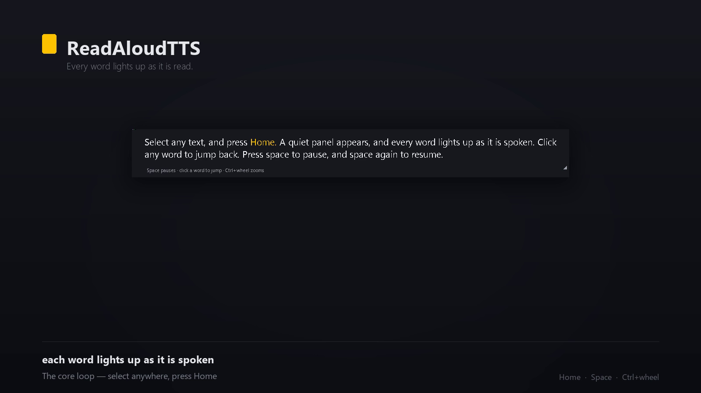

# ReadAloudTTS for Windows

[](https://github.com/LE-VAI/read-aloud-tts-windows/actions/workflows/ci.yml)
[](https://github.com/LE-VAI/read-aloud-tts-windows/releases/latest)
[](LICENSE)



Offline Windows selected-text read-aloud helper using AutoHotkey and Piper TTS. Built for local utility: **select text, press `Home`, and hear it spoken instantly** — without sending a word to a cloud service.

ReadAloudTTS is source-only, privacy-first, and designed to stay out of the way. One key to read, one key to stop. It is not a browser extension and not a cloud reader.


## The one-second pitch

Select any text. Press **`Home`**. It speaks. Press **`F6`** to stop. That's the whole interaction — no menus, no dialogs, no cloud round-trip. The Piper voice model is loaded once at startup and stays warm, so the first read is the only one with a brief model-load delay. Every read after that is near-instant.

## Hotkeys

ReadAloudTTS ships with several hotkeys so you can pick whichever fits your workflow. All of them do the same thing — read the current text selection (or stop the speech in progress).

| Action | Hotkey | Notes |
| --- | --- | --- |
| **Read selection** | `Home` | Single key. The main player. Fastest for daily use. |
| Read selection | `Ctrl + Right-click` | The original gesture. Leaves normal right-click menus intact. |
| **Stop speech** | `F6` | Single key. Cancels speech immediately, mid-sentence. |
| **Speed up** | `Ctrl + *` (`Ctrl+Shift+8`) | 10% faster. Takes effect on the next chunk. |
| **Speed down** | `Ctrl + /` | 10% slower. Takes effect on the next chunk. |
| **Reset speed** | Tray menu → Speed | Cycles through presets back to normal. |

Hotkeys are plain AutoHotkey v2 bindings near the top of `ReadAloudTTS.ahk`. Remap any of them to your own keys in seconds — see [Remapping hotkeys](#remapping-hotkeys) below.

> **Logitech MX Keys / compact keyboards:** If `F6` triggers a media key (brightness, volume) instead of a real F-key, press **`Fn + Esc`** to toggle the function-key lock. When the lock is on, F6 sends F6 directly — no `Fn` needed.

## Highlights

| Capability | Detail |
| --- | --- |
| Offline speech | Uses locally installed Piper after voice download. |
| Single-key read | Press `Home` on any selection to hear it instantly. No chord, no menu. |
| Single-key stop | Press `F6` to cancel speech the moment you've heard enough — even mid-sentence. |
| On-the-fly speed | `Ctrl + *` / `Ctrl + /` to adjust speed; tray menu Speed item resets to normal. Persists across restarts. |
| Clipboard care | Temporarily copies selection, then restores your previous clipboard contents. |
| Natural cadence | Configurable sentence pauses, inter-chunk gaps, and Piper prosody knobs. |
| Pipelined playback | Chunk N+1 is synthesized while chunk N plays, minimizing gaps. |
| Source-only | No bundled voice models, logs, generated WAVs, or binaries. |

## What it does

- Reads selected text from any app that supports normal copy.
- Offers single-key hotkeys: `Home` to read, `F6` to stop — plus `Ctrl + Right-click` as an alternative read gesture.
- Restores your previous clipboard contents after temporarily copying the selected text.
- Runs from the Windows tray with actions for reading, stopping, voice selection, config, and logs.
- Uses Piper TTS locally after voices are downloaded.

## Privacy

Selected text is briefly copied to the clipboard so the helper can read it. The previous clipboard contents are restored immediately after the selection is captured.

This tool does not send selected text to a cloud service. Piper speech synthesis runs locally after setup. Voice downloads require network access during setup or when you run `download_voices.ps1`.

Clipboard managers, endpoint tools, or apps with clipboard monitoring may observe the temporary clipboard change. Do not use this helper with text you do not want any local clipboard tool to see.

## Supported platform

Windows only.

## Prerequisites

- PowerShell.
- Python 3.12 or newer preferred.
- `winget` recommended for AutoHotkey installation.
- AutoHotkey v2.
- Piper TTS, installed into the app virtual environment by `install.ps1`.

## Quick install

Open PowerShell in the repository folder and run:

```powershell
powershell -NoProfile -ExecutionPolicy Bypass -File .\install.ps1
```

The installer uses `%LOCALAPPDATA%\ReadAloudTTS` by default, creates a Python virtual environment, installs Piper TTS, copies the source files, creates `config.json` from `config.example.json`, creates a startup shortcut, and offers to download a voice.

To skip voice download during install:

```powershell
powershell -NoProfile -ExecutionPolicy Bypass -File .\install.ps1 -SkipVoiceDownload
```

You can download voices later:

```powershell
powershell -NoProfile -ExecutionPolicy Bypass -File .\download_voices.ps1
```

## Quick uninstall

```powershell
powershell -NoProfile -ExecutionPolicy Bypass -File .\uninstall.ps1
```

By default, uninstall removes the startup shortcut and stops the helper. It asks before removing the installed app folder. To remove it without a prompt:

```powershell
powershell -NoProfile -ExecutionPolicy Bypass -File .\uninstall.ps1 -RemoveAppData -Force
```

## Usage

1. Select text in any app that supports copy.
2. Press `Home` (or `Ctrl + Right-click`).
3. Press `F6` to stop speech.
4. Use the tray menu to read, stop, change voice, open config, or open logs.

## Reading overlay

The daemon also serves a **karaoke viewer** page — the spoken text with each
word highlighted as it is spoken, in place, with a configurable highlight
color. With the daemon running, open:

```
http://127.0.0.1:8792/overlay
```

Loopback-only (never exposed to the network) and synchronized to the same
word-timing state the legacy overlay consumed. What it adds over a fixed
text box:

- **In-place rendering** of the full text — not a copy in a small window.
- **Word-by-word highlight** in your color of choice (see `highlight_color`
  below), plus a soft sentence tint under the active sentence.
- **Click any word to read from there** — the page sends a seek back to the
  daemon, which restarts speech from that word and the highlight re-anchors.
- **Join mid-read** — open the page any time during a read; it picks up the
  current text and position.

The overlay reuses the [read-along](../read-along) web component in
external-clock mode: the daemon owns the audio and the clock, the page only
renders. If the page is closed, speech is unaffected.

| Key | Default | Effect |
| --- | --- | --- |
| `overlay_port` | `8792` | Port the viewer serves on (127.0.0.1 only). A busy port disables the viewer with a log line — hotkeys and speech continue without it. |
| `highlight_color` | `#FFC400` | Hex color for the active-word highlight (any `#RGB`/`#RRGGBB`). Served as plain `rgb()` values — exotic color functions can silently drop inside `::highlight()` paint rules. |
| `component_root` | `<component source>` | Where the read-along component files live. The server serves a fixed whitelist from this root only. |

A mock daemon (`src/overlay_mock.py`) drives the same state protocol without
Piper — useful for testing the overlay UI and for screenshots:

```
python src/overlay_mock.py 8793          # then open http://127.0.0.1:8793/overlay
python src/overlay_mock.py 8793 --duration 30
```

`?autotest=1` on the overlay URL self-drives the full flow (join → advance →
seek → freeze) and holds the page's load event until the frozen receipt
frame is ready, so a headless screenshot captures the final state with the
probe line (`autotest started=… seeked=… base=…`).

## Tuning speech cadence

After install, `config.json` (in the app folder, copied from `config.example.json`) includes optional keys that control how Piper speaks. Edit the file and restart the helper for changes to take effect.

| Key | Default | Effect |
| --- | --- | --- |
| `chunk_chars` | `600` | Maximum characters per Piper invocation. Lower values = faster first audio; higher = fewer chunks (fewer cold starts). |
| `sentence_silence` | `0.4` | Seconds of silence Piper inserts after each sentence. 0.4s is close to natural speech pauses; increase for more breathing room, decrease for faster delivery. |
| `inter_chunk_pause` | `0.25` | Seconds of silence between chunk playbacks. Prevents abrupt merges at chunk boundaries. |
| `length_scale` | `1.2` | Overall speech speed. `1.0` = natural, `0.8` = slower/clearer, `1.5` = much slower, `0.5` = 2× faster. |
| `noise_scale` | `0.4` | Pitch/prosody variation. Higher = more expressive intonation; lower = flatter. 0.4 reduces random "weird inflections" while staying natural. |
| `noise_w` | `0.3` | Phoneme duration jitter. Higher = more rhythmic irregularity (can cause random mid-phrase pauses); lower = steadier cadence. 0.3 eliminates spurious pauses within phrases like "all but the last". |

If a key is absent from `config.json`, the voice model's built-in defaults are used.

## Why these hotkeys

The interaction is deliberately minimal: **one key to read, one key to stop.** `Home` is the fastest daily driver — one tap on any selection and it speaks. `F6` mirrors that convenience for stop — one tap and speech cancels immediately, even mid-sentence. `Ctrl + Right-click` is kept as an alternative read gesture for users who prefer the mouse-driven flow; it leaves normal right-click menus intact.

If `Home` or `F6` conflicts with an app (some terminals and editors hijack `Home`), remap either key in seconds — see below.

## Remapping hotkeys

Hotkeys are plain AutoHotkey v2 bindings near the top of `ReadAloudTTS.ahk` (look for the `::` lines). To remap, change the left side of any binding to your preferred key. For example, to read with `CapsLock` instead of `Home`:

```autohotkey
; In ReadAloudTTS.ahk, replace:
Home::ReadSelection()
; with:
CapsLock::ReadSelection()
```

See the [AutoHotkey v2 hotkey documentation](https://www.autohotkey.com/docs/v2/Hotkeys.htm) for the full key name list and modifier syntax. Restart the helper after editing.

## Limitations

- Works only where selected text can be copied.
- Some apps block copy or custom selection access.
- Clipboard managers may observe temporary clipboard changes.
- Voice downloads require network access during setup.
- Voice model licenses vary by voice and must be reviewed before commercial or public use.

## Safety notes

- Do not commit `config.json`, downloaded voices, generated WAV files, logs, temp files, or virtual environments.
- Run the sanitization check before any commit or publication.
- This repository is source-only and does not bundle AutoHotkey, Piper binaries, or Piper voice models.

## Repo visuals

Visual assets live in `docs/assets/`:

- `readme-hero.png`
- `social-preview.png`
- `logo-mark.png`
- `feature-strip.png`

The GitHub social preview image is `docs/assets/social-preview.png`.

## Voice licensing

Read `docs/VOICE_LICENSING.md` before downloading or using voices, especially for commercial or public work. The `hfc_female` voice is flagged as non-commercial/share-alike sensitive because its model card references CC BY-NC-SA 4.0 dataset licensing.

## Troubleshooting

If `Home` stops playing speech (typically after sleep, reboot, or an AHK reload), double-click `refresh-readaloud.cmd` in the install folder (`%LOCALAPPDATA%\ReadAloudTTS`). It restarts the TTS daemon in a few seconds and is safe to run at any time. See `docs/TROUBLESHOOTING.md` for more.
